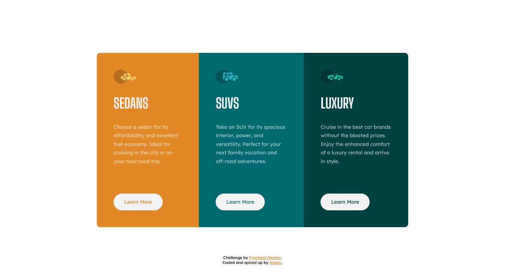

# Frontend Mentor - 3 column preview card component solution

This is a solution to the challenge on [Frontend Mentor](https://www.frontendmentor.io/).
 
Frontend Mentor challenges help you improve your coding skills by building realistic projects.

 

## Table of contents
  - [Screenshots](#screenshots)
  - [Live site](#live-site)
  - [My process](#my-process)
    - [Built with](#built-with)
    - [What I learned](#what-i-learned)
  - [Author](#author)

 

## Screenshots

Desktop

 

Mobile

 

## Live site

✨ You can interact with my solution on its dedicated [live site](https://isepec.github.io/3-column-preview-card-component/).

 

## My process

### Built with

- Semantic HTML5 markup
- CSS custom properties
- Responsive design
- Flexbox

### What I learned

- That we (frontend devs) should avoid *pixel-perfection* because it simply doesn't exist in the world of responsive design. Many factors dictate how the UI will look on a certain device and it's impractical to manually fix the discrepancies on all of the different devices, but we can (and we *should*) aim for, [as Josh Comeau would say](https://www.joshwcomeau.com/css/pixel-perfection/), *pixel-pretty-close*.

 

## Author
- Github - [isepec](https://github.com/isepec)
- Frontend Mentor - [@isepec](https://www.frontendmentor.io/profile/isepec)